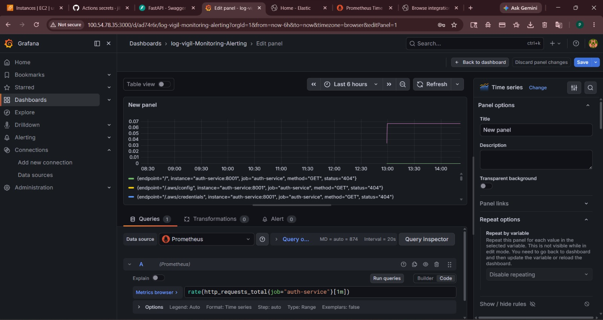

# 🔍 LogVigil – Centralized Logging & Monitoring for Microservices


## 📌 Problem Statement

In microservices architectures, logs and metrics are scattered across containers. When a service fails (e.g., login failure, payment error), debugging takes hours – you have to manually check each container's logs and correlate timestamps. **LogVigil** solves this by providing a centralized observability platform that collects, stores, and visualizes logs and metrics in real-time.

## 🏗️ Architecture
Auth Service (8001) ──logs──► Filebeat ──► Logstash ──► Elasticsearch ◄── Kibana
Order Service (8002) ──logs──┘ │
│
Auth Service ──metrics──► Prometheus ◄── Grafana ──┘
Order Service ──metrics──┘


## 🧰 Tech Stack

| Category | Tools |
|----------|-------|
| Microservices | FastAPI (Python), Uvicorn |
| Log Management | Elasticsearch, Logstash, Kibana (ELK), Filebeat |
| Metrics | Prometheus, prometheus_client |
| Visualization | Grafana |
| Containerization | Docker, Docker Compose |
| Cloud | AWS EC2 (Ubuntu 22.04) |
| Version Control | Git, GitHub |

## ✨ Features

- ✅ Two microservices (`auth-service` and `order-service`) – each generates logs and exposes `/metrics`
- ✅ Random error simulation – 20% login failure, 15% order failure (realistic chaos)
- ✅ Centralized log aggregation – all logs go to Elasticsearch, searchable via Kibana
- ✅ Metrics collection – request count, request duration, error rate
- ✅ Grafana dashboards – pre‑configured Prometheus datasource
- ✅ One‑command local setup (`docker compose up`)
- ✅ Cloud ready – tested on AWS EC2 t2.micro (lean mode) & t3.medium (full ELK)

## 📊 Live Dashboard Screenshot



*Above: Real-time request rate for auth-service as shown in Grafana.*

## 🚀 Quick Start (Local)

### Prerequisites
- Docker Desktop (4GB+ RAM recommended)
- Git

### Steps

```bash
git clone https://github.com/jibransiddiki313/log-vigil-Monitoring-Alerting.git
cd log-vigil-Monitoring-Alerting
docker compose up -d --build

# Generate a login attempt (20% will fail)
curl -X POST "http://localhost:8001/login?username=test&password=123"

# Generate an order (15% will fail)
curl -X POST "http://localhost:8002/order?product=laptop&quantity=1

"Then open Kibana → create index pattern logvigil-* → see logs.
Open Grafana → add Prometheus datasource (http://prometheus:9090) → build dashboards.


☁️ AWS EC2 Deployment
Launch Ubuntu 22.04 EC2 instance (t2.micro for lean mode, t3.medium for full ELK)

Open ports: 22, 8001, 8002, 3000, 9090, 5601

Install Docker & Docker Compose

Copy project to EC2 (scp or git clone)

Run docker compose up -d --build

Access via http://<EC2_PUBLIC_IP>:8001/docs

📊 Monitoring & Alerting
Grafana dashboards ready (request rate, error rate, service uptime)

Alerting via Prometheus Alertmanager (can be configured for Slack/email)

Sample alert rule: error rate > 10% for 2 minutes

🔄 CI/CD Pipeline (Optional)
This repository includes a GitHub Actions workflow (.github/workflows/deploy.yml) that automatically deploys to EC2 on every git push to the main branch.
Secrets required: EC2_HOST, EC2_USERNAME, EC2_SSH_KEY.

🛠️ Future Improvements
Centralized logging with full ELK stack on larger instance

Slack alerts using Alertmanager

Terraform for infrastructure as code

Kubernetes deployment (EKS/minikube)

Custom domain + HTTPS

👨‍💻 Author
Jibran Siddiki – DevOps Enthusiast
GitHub • LinkedIn

📜 License
MIT

Built with 🐳 Docker, 🐍 FastAPI, 📊 Prometheus, and ☁️ AWS.
